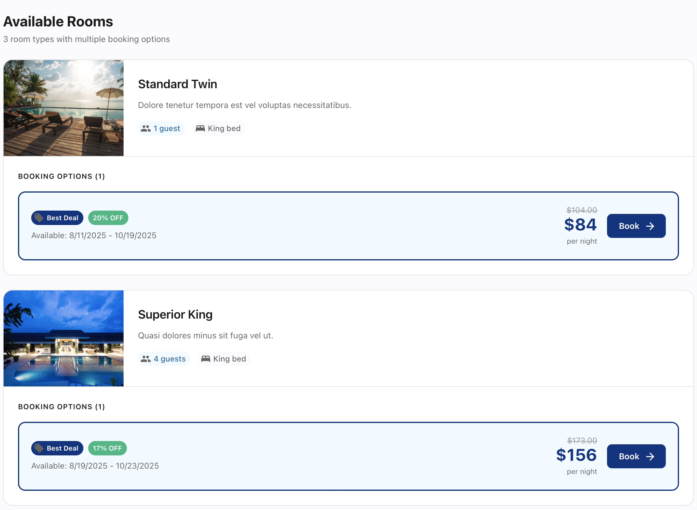

# 🏨 Hotel Comparison Platform

<div align="center">

**A full-stack hotel search and booking platform showcasing [BaseAPI](https://github.com/timanthonyalexander/base-api)**

*Built with PHP 8.4, BaseAPI framework, and React + TypeScript*

[Features](#-features) • [Screenshots](#-screenshots) • [Architecture](#-architecture) • [Setup](#-quick-start) • [Tech Stack](#-tech-stack)

</div>

---

## 📖 Overview

This is a **production-ready hotel comparison and booking platform** that demonstrates the power and simplicity of BaseAPI — a lightweight, convention-over-configuration PHP 8.4+ framework for building REST APIs.

The application provides a modern, user-friendly interface for searching hotels across multiple European and US cities, comparing prices, viewing detailed information, and making bookings — all powered by a robust backend API built entirely with BaseAPI.

### What Makes This Special?

- ✨ **Real-world complexity**: Handles search with caching, async job processing, and complex filtering
- 🔐 **Dual authentication**: Supports both session-based and API token authentication
- 🚀 **Background jobs**: Asynchronous search processing using BaseAPI's queue system
- 💾 **Smart caching**: Redis/file-based caching with deterministic hashing for search results
- 🎯 **Rate limiting**: Per-endpoint rate limits to prevent abuse
- 📊 **Rich data model**: 5,000+ hotels across 100 cities with realistic pricing
- 🎨 **Beautiful UI**: Modern, responsive React frontend with smooth UX

---

## ✨ Features

### Core Functionality

#### 🔍 **Smart Hotel Search**
- Location autocomplete with fuzzy matching
- Date range selection with validation
- Guest capacity filtering (1-12 guests)
- Asynchronous search processing with real-time updates
- Deterministic caching to avoid duplicate searches
- Results sorted by best price

#### 🏨 **Hotel Browsing**
- Browse 50+ hotels per city across 100 locations
- Star ratings (2-5 stars)
- Multiple room categories (Standard, Deluxe, Suite, Penthouse, etc.)
- Capacity-aware filtering (only show rooms that fit your party)
- Multiple offers per room with discount badges

#### 📅 **Smart Booking System**
- Date availability validation
- Price calculation with discounts
- Instant booking confirmation
- Booking history and management
- Detailed booking receipts

#### 🔐 **Authentication & Security**
- User signup and login
- Session-based authentication for web
- API token authentication for programmatic access
- Combined authentication middleware (supports both methods)
- Rate limiting on sensitive endpoints
- Secure password hashing

### Technical Features

- **RESTful API** with OpenAPI documentation
- **Background job processing** for intensive operations
- **Query optimization** with eager loading and batch queries
- **Cross-database compatibility** (SQLite, MySQL, PostgreSQL)
- **Comprehensive validation** with custom rules
- **Error handling** with detailed error responses

---

## 🖼️ Screenshots

### Home Page - Search Interface

*Beautiful hero section with intuitive search form. Location autocomplete, date pickers, and guest selection all in one place.*

### Search Results

*Clean results page showing available hotels sorted by price. Each card displays star rating, pricing, and room availability.*

### Hotel Detail - Available Rooms

*Detailed view of a hotel showing all available room types with pricing options, discount badges, and instant booking.*

### Booking Confirmation

*Beautiful confirmation page with all booking details, pricing breakdown, and unique booking ID.*

### My Bookings

*User dashboard showing all bookings with check-in/check-out dates, pricing, and quick access to details.*

---

## 🏗️ Architecture

This application showcases **real-world patterns** built on top of BaseAPI's foundation:

### Data Models

```
User
  ├─ ApiToken (1:many)
  └─ Booking (1:many)

Location
  └─ Hotel (1:many)
       └─ Room (1:many)
            └─ Offer (1:many)

Search
  ├─ belongs to User
  ├─ belongs to Location
  └─ cached with deterministic hash
```

**8 Core Models:**
- `User` - User accounts with password hashing
- `ApiToken` - API authentication tokens with expiration
- `Location` - Cities with coordinates
- `Hotel` - Hotels with star ratings
- `Room` - Room types with capacity
- `Offer` - Price offers with date ranges and discounts
- `Search` - Search requests with caching
- `Booking` - Confirmed bookings

### Controllers & API Endpoints

#### Public Endpoints
```
GET  /health                          # Health check
GET  /locations/autocomplete?query={} # Location search
POST /auth/signup                     # User registration
POST /auth/login                      # User login
```

#### Protected Endpoints (Session or API Token)
```
GET  /me                              # Current user info
POST /auth/logout                     # Logout

GET  /api-tokens                      # List API tokens
POST /api-tokens                      # Create API token
DELETE /api-tokens/{id}               # Delete API token

POST /search                          # Create hotel search
GET  /search/{search_id}              # Get search results

GET  /bookings                        # List user bookings
GET  /bookings/{booking_id}           # Get booking details
POST /bookings                        # Create booking
```

### Background Jobs

**SearchJob** - The heart of the platform
- Executes complex hotel/room/offer queries
- Filters by capacity and date availability
- Implements sophisticated date containment logic
- Sorts results by cheapest price
- Caches results for 1 hour with deterministic hashing
- Handles edge cases (no results, expired offers, etc.)

Other example jobs included:
- `SendEmailJob` - Async email sending
- `BackupDatabaseJob` - Automated database backups
- `ProcessImageJob` - Image transformation
- `CallExternalApiJob` - External API integration

### Middleware Stack

**CombinedAuthMiddleware** - Hybrid authentication
- Tries API token authentication first (Bearer tokens)
- Falls back to session authentication
- Attaches user and auth method to request
- Enables same endpoints for web and API clients

**RateLimitMiddleware** - API protection
- Per-endpoint rate limits
- Prevents abuse on sensitive operations
- Configured in routes (e.g., "5/1m" = 5 per minute)

### Database & Performance

**Seeded Data**
- 100 locations across 10 countries
- 5,000 hotels (50 per city)
- 50,000+ rooms (7-15 per hotel)
- 150,000+ offers (2-6 per room)

**Query Optimization**
- Eager loading to prevent N+1 queries
- Batch fetches (e.g., `whereIn` for offers)
- Indexed foreign keys and frequently queried fields
- Deterministic search hashing to avoid duplicate work

**Caching Strategy**
```php
// Generate deterministic hash from search params
$hash = hash('sha256', 
  $user_id . '|' . $location_id . '|' . 
  $starts_on . '|' . $ends_on . '|' . $capacity
);

// Check cache before processing
if (Cache::has($hash)) {
    return Cache::get($hash);
}

// Process search and cache for 1 hour
Cache::put($hash, $results, 3600);
```

### Frontend Architecture

**Modern React + TypeScript SPA**
- Vite build system for fast development
- React Router for navigation
- Custom API client with axios
- Session management with automatic redirects
- Responsive design for mobile and desktop
- Real-time search status updates

---

## 🚀 Quick Start

### Prerequisites

- PHP 8.4 or higher
- Composer
- SQLite (included) or MySQL/PostgreSQL
- Node.js 18+ and npm (for frontend)

### Backend Setup

```bash
# Navigate to the hotels directory
cd hotels

# Install PHP dependencies
composer install

# Copy environment configuration
cp .env.example .env

# Edit .env if needed (defaults work fine for local development)
# Set queue driver to 'sync' for simple dev setup:
# QUEUE_DRIVER=sync

# Generate database migrations
php mason migrate:generate

# Apply migrations
php mason migrate:apply

# Seed the database with sample data (this creates 5,000+ hotels)
php scripts/seed.php

# Start the API server
php mason serve
```

The API will be available at `http://localhost:7879`

### Frontend Setup

```bash
# Navigate to the web directory
cd web

# Install dependencies
npm install

# Start the development server
npm run dev
```

The frontend will be available at `http://localhost:5173`

### Creating Your First User

1. Open `http://localhost:5173` in your browser
2. Click "Sign up" or navigate to `/signup`
3. Fill in your name, email, and password
4. You'll be automatically logged in!

### Queue Worker (Optional)

For production or testing background jobs:

```bash
# Set queue driver in .env
QUEUE_DRIVER=database

# Start the queue worker
php mason queue:work
```

---

## 🧪 Testing the API

### Using the Frontend
The easiest way to test is using the included React frontend at `http://localhost:5173`.

### Using cURL

```bash
# Health check
curl http://localhost:7879/health

# Location autocomplete
curl "http://localhost:7879/locations/autocomplete?query=berlin"

# Sign up
curl -X POST http://localhost:7879/auth/signup \
  -H "Content-Type: application/json" \
  -d '{
    "name": "John Doe",
    "email": "john@example.com",
    "password": "password123"
  }'

# Login and save session cookie
curl -X POST http://localhost:7879/auth/login \
  -c cookies.txt \
  -H "Content-Type: application/json" \
  -d '{
    "email": "john@example.com",
    "password": "password123"
  }'

# Create a search (using session)
curl -X POST http://localhost:7879/search \
  -b cookies.txt \
  -H "Content-Type: application/json" \
  -d '{
    "location_id": "<location-id-from-autocomplete>",
    "starts_on": "2025-10-15",
    "ends_on": "2025-10-20",
    "capacity": 2
  }'

# Get search results
curl http://localhost:7879/search/{search_id} -b cookies.txt
```

### Using API Tokens

```bash
# Create an API token (requires session auth first)
curl -X POST http://localhost:7879/api-tokens \
  -b cookies.txt \
  -H "Content-Type: application/json" \
  -d '{"name": "My API Token"}'

# Use the token for authentication
curl http://localhost:7879/me \
  -H "Authorization: Bearer <your-token>"
```

---

## 📚 What This Project Demonstrates

### BaseAPI Framework Features Used

#### ✅ **Models & ORM**
- Active Record pattern with typed properties
- Automatic migrations from PHP types
- Relationships (belongsTo, hasMany)
- Query builder with where, whereIn, orderBy
- Eager loading with `with()`

#### ✅ **Routing**
- RESTful route definitions
- URL parameter injection (`{id}`)
- Middleware pipelines per route
- Route grouping with shared middleware

#### ✅ **Controllers**
- Convention-based HTTP verb methods
- Automatic property injection from request
- Built-in validation with custom rules
- Typed request properties
- JsonResponse helpers

#### ✅ **Validation**
- Rule-based validation system
- Custom validation rules
- Date validation (date_format, after)
- Complex rules (min, max, email, etc.)
- Automatic error responses

#### ✅ **Queue System**
- Job-based background processing
- Automatic retries with exponential backoff
- Failed job handling
- Multiple queue drivers (sync, database)
- Job serialization

#### ✅ **Caching**
- Multiple cache drivers (file, Redis, array)
- TTL-based expiration
- Cache keys with automatic invalidation
- Performance optimization

#### ✅ **Middleware**
- Custom middleware implementation
- Request/response pipeline
- Authentication middleware
- Rate limiting middleware
- Middleware composition

#### ✅ **Dependency Injection**
- Constructor injection in controllers
- Service providers
- Singleton services
- Auto-resolution of dependencies

#### ✅ **Database**
- Cross-database compatibility
- Multiple driver support (SQLite, MySQL, PostgreSQL)
- Query builder
- Raw SQL support
- Migrations with safe mode

### Advanced Patterns Implemented

#### **Deterministic Caching**
Searches are cached using a deterministic hash of search parameters, ensuring identical searches return cached results instantly:

```php
public function generateDeterministicHash(): string
{
    $data = $this->user_id . '|' . 
            $this->location_id . '|' . 
            $this->starts_on . '|' . 
            $this->ends_on . '|' . 
            $this->capacity;
    return hash('sha256', $data);
}
```

#### **Hybrid Authentication**
One middleware that supports both session and API token auth:

```php
// Try API token first
$user = $this->tryApiTokenAuth($request);

// Fall back to session
if (!$user) {
    $user = $this->trySessionAuth();
}
```

#### **Complex Date Logic**
Hotel booking semantics with half-open intervals:

```php
protected function offerCoversStay(
    string $offerStart, 
    string $offerEnd, 
    string $searchStart, 
    string $searchEnd
): bool {
    // Offer must contain the requested stay
    return $oS <= $sS && $sE <= $oE;
}
```

#### **Query Optimization**
Batch loading to eliminate N+1 queries:

```php
// Get all room IDs
$roomIds = array_map(fn($r) => $r->id, $rooms);

// Single query for all offers
$offers = Offer::query()
    ->whereIn('room_id', $roomIds)
    ->where('availability', '=', true)
    ->get();

// Bucket by room_id
$byRoom = [];
foreach ($offers as $o) {
    $byRoom[$o->room_id][] = $o;
}
```

---

## 🛠️ Tech Stack

### Backend
- **PHP 8.4** - Modern PHP with typed properties, enums, and match expressions
- **BaseAPI 0.7.10+** - Lightweight REST API framework
- **SQLite/MySQL/PostgreSQL** - Cross-database support
- **Redis** - Caching (optional)

### Frontend
- **React 18** - UI library
- **TypeScript** - Type safety
- **Vite** - Build tool
- **React Router** - Routing
- **Axios** - HTTP client

### Development Tools
- **PHPStan** - Static analysis (Level 9)
- **Rector** - PHP modernization
- **PHPUnit** - Testing
- **ESLint** - JavaScript linting
- **Git Hooks** - Pre-commit quality checks

---

## 📁 Project Structure

```
hotels/
├── app/
│   ├── Controllers/          # API endpoints
│   │   ├── SearchController.php
│   │   ├── BookingController.php
│   │   ├── LocationAutocompleteController.php
│   │   └── ...
│   ├── Models/               # Data models
│   │   ├── User.php
│   │   ├── Hotel.php
│   │   ├── Room.php
│   │   ├── Offer.php
│   │   ├── Booking.php
│   │   └── ...
│   ├── Jobs/                 # Background jobs
│   │   ├── SearchJob.php
│   │   └── ...
│   ├── Middleware/           # Custom middleware
│   │   └── CombinedAuthMiddleware.php
│   ├── Services/             # Business logic
│   │   └── EmailService.php
│   └── Providers/            # Service providers
│       └── AppServiceProvider.php
├── routes/
│   └── api.php              # API routes
├── config/
│   └── app.php              # Application config
├── scripts/
│   └── seed.php             # Database seeding
├── web/                     # React frontend
│   ├── src/
│   │   ├── components/
│   │   ├── pages/
│   │   └── lib/
│   └── ...
├── storage/                 # Logs, cache, DB
├── .env                     # Environment config
└── mason                    # CLI tool
```

---

## 🎓 Learning Resources

### About BaseAPI

- **Repository**: [github.com/timanthonyalexander/base-api](https://github.com/timanthonyalexander/base-api)
- **Package**: [packagist.org/packages/baseapi/baseapi](https://packagist.org/packages/baseapi/baseapi)
- **Documentation**: See `../baseapi/docs/` for comprehensive guides

### Key Concepts to Explore

1. **Convention over Configuration**: See how little config is needed
2. **Type-driven Migrations**: Models automatically generate database schema
3. **Automatic Routing**: HTTP verb methods map to route handlers
4. **Property Injection**: Request data automatically populates controller properties
5. **Middleware Composition**: Build authentication/authorization pipelines
6. **Job Queues**: Offload heavy work to background workers
7. **Service Providers**: Manage dependency injection

---

## 🚧 Future Enhancements

This project is a showcase, but here are ideas for extending it:

- [ ] Payment processing integration (Stripe, PayPal)
- [ ] Email notifications for bookings
- [ ] Hotel reviews and ratings
- [ ] Search filters (price range, amenities, star rating)
- [ ] Multi-currency support
- [ ] Booking modifications and cancellations
- [ ] Admin dashboard for hotel management
- [ ] Real-time availability updates via WebSockets
- [ ] Image uploads for hotels
- [ ] Internationalization (i18n)

---

## 📝 License

MIT License - feel free to use this as a template for your own projects!

---

## 🙏 Credits

Built with [BaseAPI](https://github.com/timanthonyalexander/base-api) - a lightweight, KISS-first PHP 8.4+ framework.

This project demonstrates real-world patterns for building production-ready APIs with BaseAPI, including authentication, background jobs, caching, and complex business logic.

---

<div align="center">

**Happy coding! 🚀**

*Questions? Check out the [BaseAPI documentation](../baseapi/docs/) or explore the code!*

</div>
